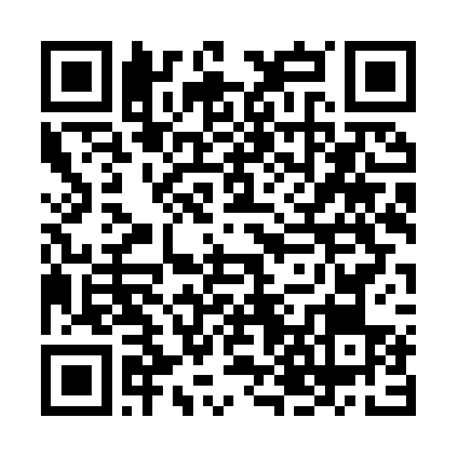
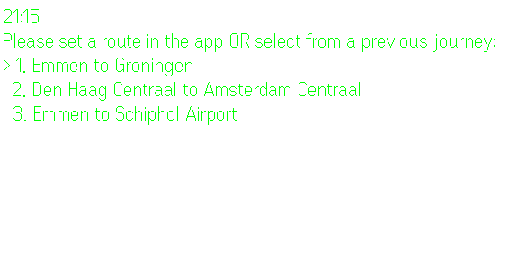
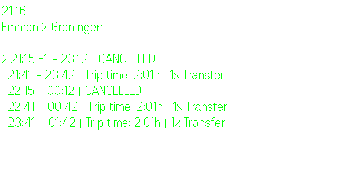
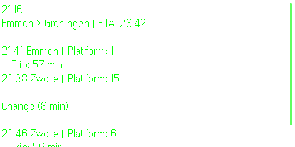
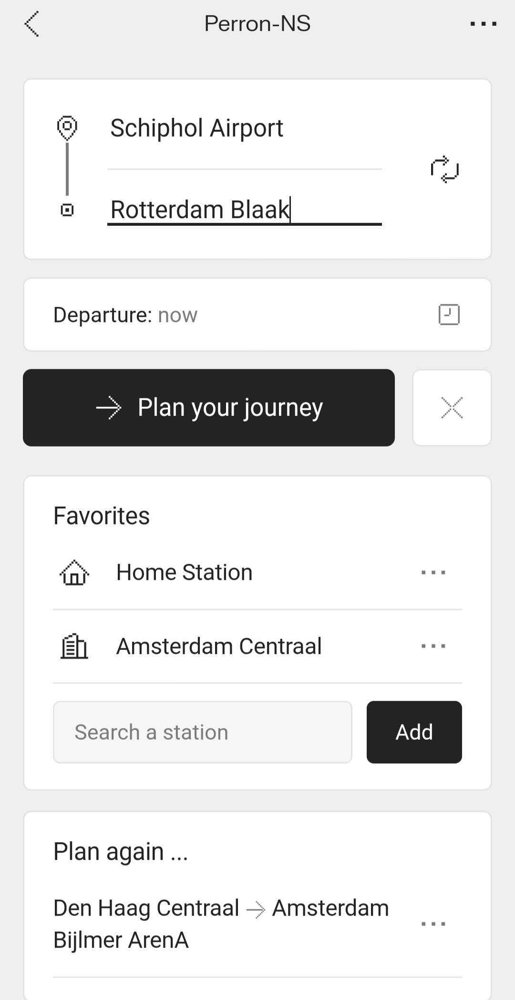
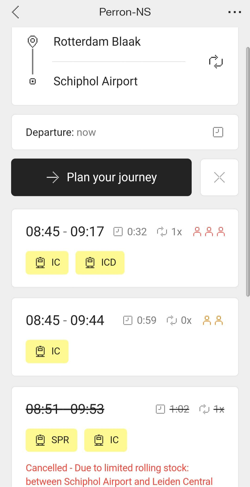
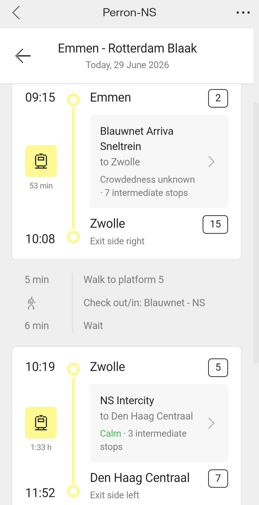

# Perron-NS


NS (Dutch Railways) journey planner for **Even Realities G2**, built as an **Even Hub** app. The glasses lens is a glanceable clock that displays live departure boards. The planning (From/To, favorites, recent journeys) can be set on the companion app. Live data comes from the NS Reisinformatie API through a tiny proxy.

## Install

Scan with the **Even Realities app** on your phone, or open the listing on Even Hub:

[](https://evenhub.evenrealities.com/landing?package_id=com.perron.ns)

**[evenhub.evenrealities.com → Perron-NS](https://evenhub.evenrealities.com/landing?package_id=com.perron.ns)**

## Features

- **Glanceable lens** - the current time, top-left, on every screen.
- **Live departure boards** - times, delays (`+N`), platforms, transfers,
  cancellations and crowd forecasts, straight from NS.
- **Phone planner** - From/To with live station autocomplete, a **Favorites**
  list, and a **"Plan again"** history of recent routes.
- **Phone ↔ glasses mirroring** - whatever the phone shows, the lens follows;
  temple gestures move the lens locally.
- **Auto-refresh** - an open board re-fetches every 60s so cancellations and
  delays land without re-navigating.

## Lens screens

1. **Home** - clock plus your recent journeys. Swipe to highlight one.
2. **Times list** - upcoming departures for the selected route.
3. **Journey detail** - the full board: per-leg times, stations, platforms,
   transfers and ETA.

## Screenshots

### On the glasses
| Route select | Departures | Journey detail |
|---|---|---|
|  |  |  |

### On the phone
| Planner | Results | Journey detail |
|---|---|---|
|  |  |  |

## Architecture

```
        NS Reisinformatie API  (gateway.apiportal.ns.nl)
                  ▲
                  │  key injected server-side
        Cloudflare Worker  (proxy/worker.js)  ──▶  /privacy page
                  ▲
                  │  HTTPS + CORS
        Phone WebView  ──── BLE ────▶  G2 glasses lens
        (journey planner)              (clock + boards)
```

```
app.json            Even Hub manifest (package id, sdk version, permissions)
index.html          WebView shell (mounts src/main.ts)
src/
  main.ts           SDK bridge: lens clock + gestures, and the phone planner
  ns.ts             NS API client (trips, stations, departures, disruptions)
  style.css         Even OS 2.0 styling
  icons/            Even OS 2.0 icon set (inlined as raw SVG)
proxy/
  worker.js         Worker: injects the NS key, adds CORS, serves /privacy
  wrangler.toml     Worker deploy config
assets/             app icon (component, foreground, background, composite)
images/             glasses + phone screenshots, store QR
PRIVACY.md          privacy policy (also served at the proxy's /privacy)
RELEASE_NOTES.md    store release notes
CHANGELOG.md        version history
```

## Navigation (temple gestures)

| Gesture     | Home              | Times list          | Journey detail       |
|-------------|-------------------|---------------------|----------------------|
| Swipe up    | Previous journey  | Earlier departure   | —                    |
| Swipe down  | Next journey      | Later departure     | —                    |
| Tap         | Open the journey  | View this departure | —                    |
| Double-tap  | Exit app          | Back to home        | Back to times list   |

Journeys are planned on the companion app since it has a keyboard. The glasses show
the clock and up to three recent journeys. Tap a journey to see its departure
times. Tap a time to open the full board - when and where each train leaves and
arrives, and which platform to board. Double-tap steps back a screen, and exits
the app from the home screen.

## Setup

```bash
npm install
npm run dev          # Vite dev server on http://localhost:5173
npm run simulate     # G2 simulator (use simulate:auto for the automation API)
```

Sideload to real glasses or build a package:

```bash
npm run qr           # QR code for Even app dev mode
npm run pack         # build + package into perron-ns.ehpk
```

### Backend proxy

Live data needs the NS proxy deployed once (the key stays server-side):

```bash
cd proxy
wrangler login
wrangler secret put NS_API_KEY   # paste your NS Primary key
wrangler deploy
```

Then set `BASE` in `src/ns.ts` and the network `whitelist` in `app.json` to your
Worker URL. See [`proxy/README.md`](proxy/README.md) for details.

## Tech stack

- **NS Reisinformatie API** - via a Cloudflare Worker proxy
- **@evenrealities/even_hub_sdk** - glasses rendering + gesture events
- **Vite + TypeScript** - build and dev server
- **@evenrealities/evenhub-cli** - `qr` / `pack`
- **@evenrealities/evenhub-simulator** - local preview + screenshot automation
- **Even OS 2.0** - design tokens and icon set
